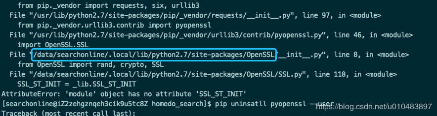

# centos_resign_ipa

#安装isign
https://github.com/saucelabs/isign

#如果遇到module' object has no attribute 'SSL_ST_INIT'

操作步骤：
进入到上图中的目录：
cd /data/searchonline/.local/lib/python2.7/site-packages/
删除文件夹：
rm -rf OpenSSL/
rm -rf pyOpenSSL-0.15.1.dist-info/
pip install pyopenssl
